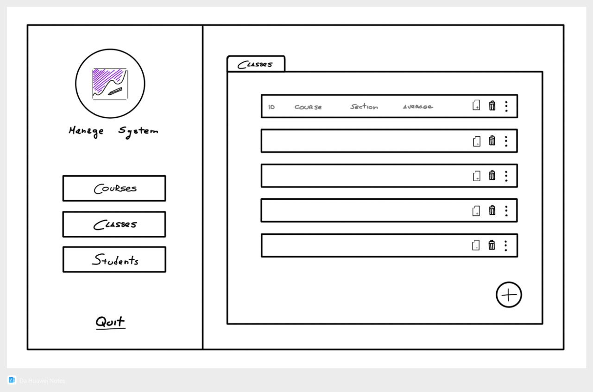

    
    <h2 align="center">Edu Inc - 📚 Univerity Manage System</h2>

System for managing students' grades, organized into courses and classes.  
Supports both a text-based interface and a GUI built with raylib + raygui.

    

## Gallery

  

    <samp>
      Lorem 
       
      Lorem
    </samp>
  

