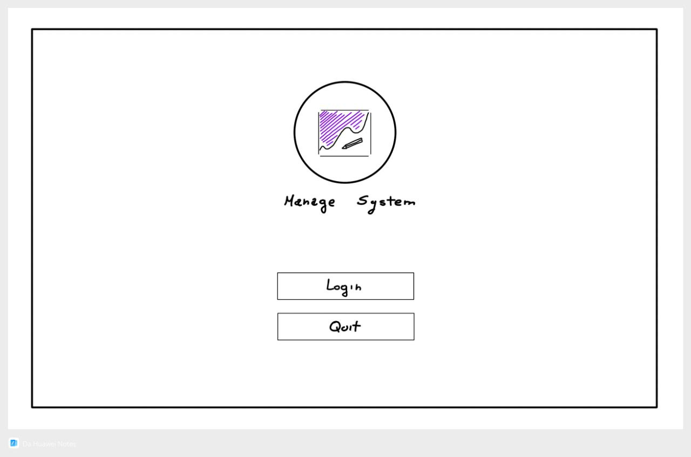
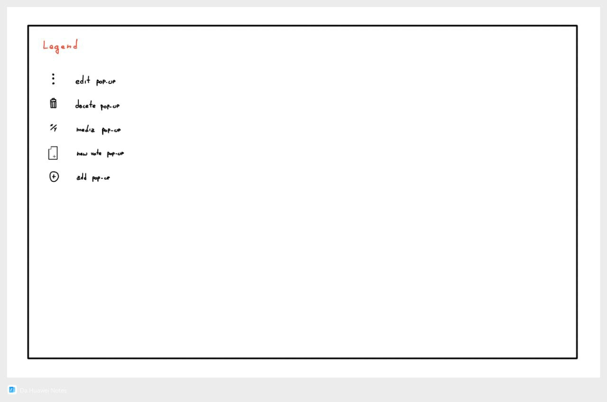

<p align="center">
    
    <h2 align="center">Edu Inc - 📚 Univerity Manage System</h2>
</p>

<p align="center">System for managing students' grades, organized into courses and classes.  
Supports both a text-based interface and a GUI built with raylib + raygui.</p>

<p align="center">
    <a href="https://github.com/rose-pine/rose-pine-theme">
        
    </a>
</p>

## 📝 Descrizione 

This project implements a university grade management system using a procedural approach in C++.
<br>
It allows you to:

1. Manage courses, classes, and students
2. Enter and view grades
3. Calculate averages
    
Two versions are available: 

1. Console : `GradebookConsole`
2. GUI (Graphical): `GradebookGui` – Built with Raylib + RayGUI
     
The code is structured into separate modules:

- The code is split into dedicated files: `Student`, `Class`, `Course`, `Grades`, `Utils`
- Dedicated functions for operations on each entity
- All files logically organized in structured directories

Each module consists of:
- A `.h` file (header) for declaring structs and functions
- A `.cpp` file (implementation) containing function definitions


## Gallery



<p float="left">
  <p float="left">
    <samp><br><br>  
      Stylized conceptual sketches outline the low-fidelity GUI architecture. 
      <br>
      These representations constitute the initial iteration of the software design.
      <br><br><br>  
      Initiating a project with low-fidelity prototypes represents an established best practice in software development and interface design.
    </samp>
  </p>
</p>

<p float="left">
  <p float="left">
    <samp>
      1. Saves Time & Resources   
        <br>  
      2. Focuses on Functionality First 
        <br>  
      3. Enhances Collaboration
    </samp>
  </p>
</p><br>


```Json
{
	"program": "Note",
    "web program": "Figma",
    "primary color": "#FFFFFF",
    "secondary color": "#000000",
    "color detail": "#830CDA"
}
```

<details close>
    <summary><a>Sketches</a> (Stylized Conceptual)</summary>
    
    
    
    
    <br>
    <details close>
        <summary><a>Pop-Up</a></summary>
        
        
        
        
        
    </details>
</details>


